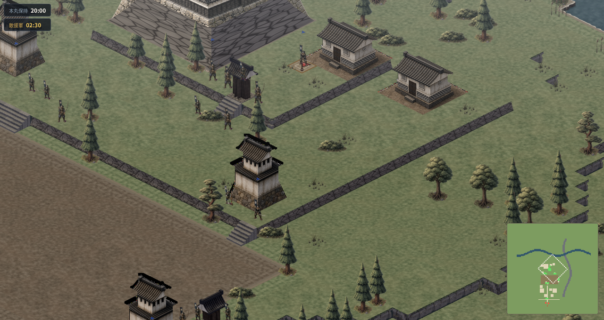
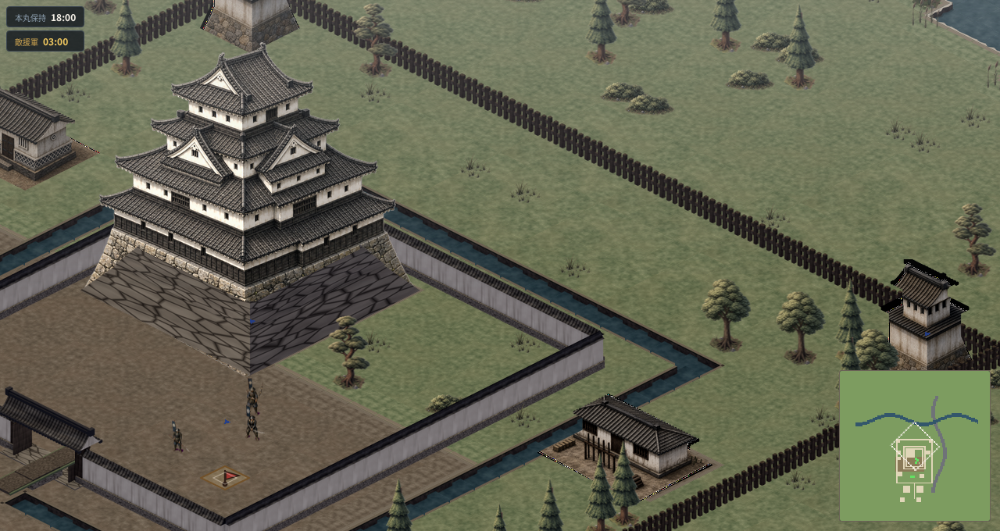
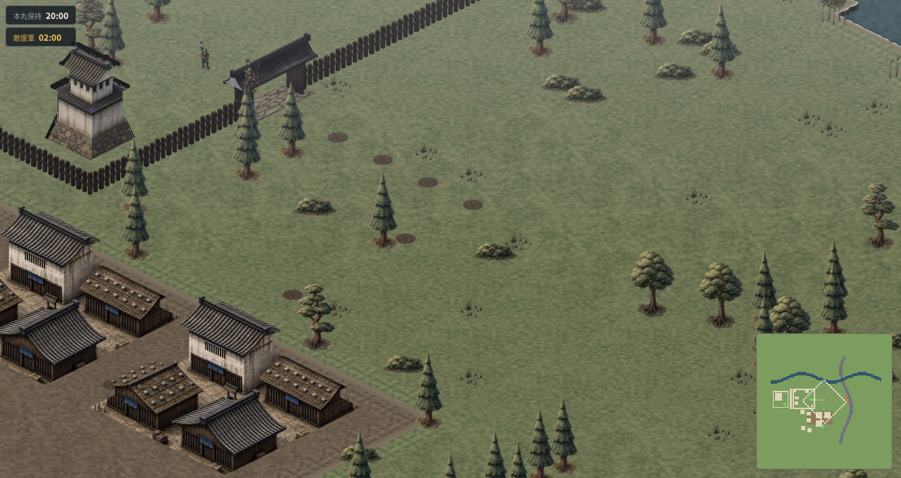
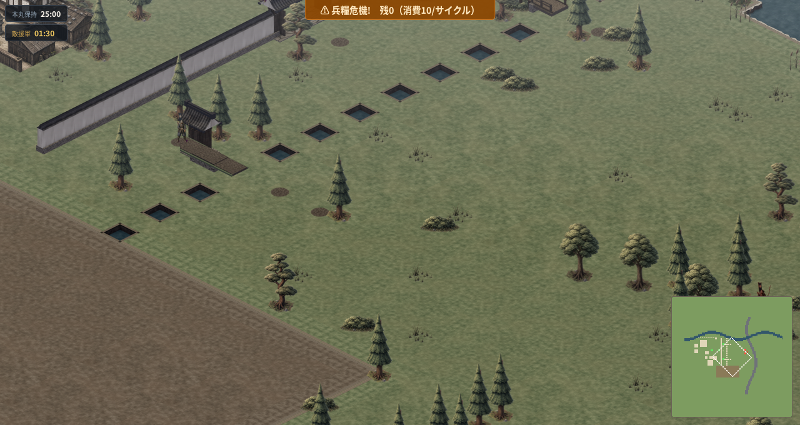

# 浅間 (Asama)

> 日本戦国時代を舞台にしたブラウザ動作のアイソメトリックRTS



## ゲーム概要

プレイヤーは城主となり、迫り来る敵の波状攻撃から城を守る。壁・堀・石垣を築き、槍足軽・弓兵・騎馬・鉄砲衆を指揮して本丸を死守せよ。Stronghold風の固定アイソメトリック2D RTSで、ブラウザ完結・インストール不要。

**ゲームの特徴:**
- 高低差地形 — 石垣で高台を作り、高地から一方的に攻撃
- 6種類のユニット — 槍足軽・刀足軽・弓兵・鉄砲・騎馬・工兵
- 動く植生 — 樹木や幟が風になびくリアルタイムアニメーション
- 10シナリオ + 自由演習 — 入門の環郭から高石垣の平山城まで

## スクリーンショット

### 霞ヶ峰城 (高低差ショーケース)


### 環郭の城 (入門)


### 連郭の城 / 川沿いの城

| 連郭の城 | 川沿いの城 |
|---|---|
|  |  |

## 遊び方

1. ブラウザで `http://localhost:5173` を開くとシナリオ選択画面
2. シナリオを選んでゲーム開始
3. ユニットをクリックして選択 → 移動先を右クリックで移動指示
4. 建物はパネルから選択して配置
5. 敵の進軍を食い止めながら本丸を守れ

### 主な操作

| 操作 | 動作 |
|---|---|
| 左クリック / 左ドラッグ | ユニット選択 / 範囲選択(Shiftで追加・除外) |
| 右クリック | 移動(陣形展開)・敵を攻撃 |
| A + 左クリック | 攻撃移動 |
| S | 停止 |
| 自軍の門を左クリック | 開閉 |
| 矢印キー / 中ボタンドラッグ / ミニマップ | カメラ移動 |
| ホイール | ズーム |
| Space / ⏸ 1x 2x 4x | 一時停止・速度変更 |
| 梯子設置・堀埋めボタン | 工兵を選択して対象セルを指定 |

## シナリオ一覧

| シナリオ | 縄張 | 特徴 |
|---|---|---|
| 環郭の城 | 環郭式 | 入門。同心円防衛・補給荷車撃破 |
| 連郭の城 | 連郭式 | 東西二方向の敵・騎馬の南側奇襲 |
| 川沿いの城 | 川城 | 橋頭堡防衛・工兵による橋破壊 |
| 霞ヶ峰城 | 山城 | 三段石垣・坂の制圧・高低差戦略 |
| 浮城 | 水城 | 二重水堀と五つの橋。橋落とし・堀埋め |
| 大手筋の城下 | 惣構 | 城下町の一本道で敵縦列を削る |
| 切通しの砦 | 土の砦 | 石垣なし。切通しの坂口を土塁から射撃 |
| 段郭の城 | 連郭式 | 曲輪を失うたび一段上へ退く段階防衛 |
| 五段積の城 | 平山城 | 五段石垣と九十九折の登城路 |
| 高石垣の城 | 平山城 | 三〜五段の高石垣・段ごとの門で防衛 |
| 自由演習 | — | 資源無制限・敗北なしのサンドボックス |

## 開発・起動

```sh
nix-shell          # nodejs / pnpm / blender が入る
pnpm install
pnpm run dev       # http://localhost:5173
```

セーブ機能を使う場合は別ターミナルでローカルAPIも起動:

```sh
pnpm --filter @asama/game dev:server   # http://127.0.0.1:3000 (viteがproxy)
```

## 技術スタック

- **フロントエンド**: React 19 + PixiJS v8.6 (WebGL/WebGPU)
- **ゲームロジック**: Web Worker 上で動作するピュアTypeScript
- **アセット**: Blender 5.1 → PNG パイプライン(手続き的モデリング)
- **テスト**: Vitest + Playwright E2E

## 開発コマンド

```sh
pnpm run typecheck
pnpm test
pnpm run assets:all                  # アセットパイプライン(Blenderレンダー+検証)
pnpm run assets:lint:art             # アートlint(ビジュアルQAゲート L1)
pnpm run assets:blender:calibration  # アイソメ契約のキャリブレーション検証
pnpm run assets:alignment:contact-sheet
node apps/game/qa/shot.mjs --preset <name>  # 定点スクリーンショット(要dev server)
```

Blenderレンダーはキャッシュされ、`assets/source/blender/scripts/render_asset.py`(全モデルの手続き定義)や対象ジオメトリが変わった分だけ再実行されます。

開発フロー全体(ブランチ運用・ビジュアルQAゲート・エージェント委任)は [Workflow.md](Workflow.md) を参照。

## 構成

- `apps/game` — Vite/React クライアント、PixiJS レンダラー、Web Worker シミュレーションループ、Fastify セーブAPI
- `packages/simulation` — ゲームロジック(経路探索・戦闘・兵糧・経済・敵AI・勝敗)。React/DOM非依存
- `packages/content` — データ定義(建物・ユニット・シナリオ)
- `packages/shared` — 型と定数
- `packages/asset-tools` — アセットパイプラインCLI(Blenderレンダー、後処理、検証、監査)
- `docs/` — 仕様書一式(読み順は `docs/README.md`)

## 設計の要点

- ランタイムはアセットの出所(Blender/ラスター)を認識しない(`docs/05_map-and-art/asset-pipeline.md`)
- アイソメ配置はピクセル契約で固定(`docs/05_map-and-art/isometric-alignment.md`)。Blenderカメラリグが構築時に保証し、`assets:blender:calibration` が常時検証
- 未確定のバランス値は `FOOD_BALANCE` / `ECONOMY_BALANCE` / `SIEGE_BALANCE` 等の定数と `packages/content` のシナリオデータに集約(`docs/10_development/unresolved-issues.md`)
